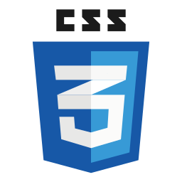

### Hi there, I'm Amin 👋

## I'm a Husband, Father, Developer, and Gamer!!

- I’m currently learning everything 🤣
- I’m looking to collaborate with other content creators
- Goals: Contribute more to Make the web world Amazing!

 

### Languages and Tools:

<!-- Start Icons languages -->

<!-- End Icons languages -->

 
 

### Interesting projects:

- [Cards minigame](https://github.com/mazaalani/black-jack-no-AI) : Card game using ES6 class [Try it Yourself](https://mazaalani.github.io/black-jack-with-AI/)
- [Account creation form](https://github.com/mazaalani/account-creation) : Multipage account creation with validation.[Try it Yourself](https://mazaalani.github.io/account-creation/)
- [fetch students](https://github.com/mazaalani/Json_Fetch_Students) : fetch students information from online API.[Try it Yourself](https://mazaalani.github.io/Json_Fetch_Students/)

[More...](https://github.com/mazaalani?tab=repositories)
